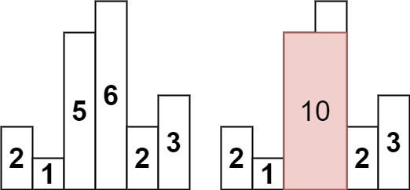
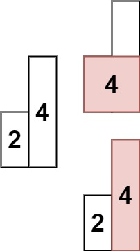

## Algorithm

[84. 柱状图中最大的矩形](https://leetcode.cn/problems/largest-rectangle-in-histogram/description/?envType=study-plan-v2&envId=top-100-liked)

### Description

给定 n 个非负整数，用来表示柱状图中各个柱子的高度。每个柱子彼此相邻，且宽度为 1 。

求在该柱状图中，能够勾勒出来的矩形的最大面积。

示例 1:



```
输入：heights = [2,1,5,6,2,3]
输出：10
解释：最大的矩形为图中红色区域，面积为 10
```

示例 2：



```
输入： heights = [2,4]
输出： 4
```

提示：

- 1 <= heights.length <=105
- 0 <= heights[i] <= 104

### Solution

```java
class Solution {
    public int largestRectangleArea(int[] heights) {
        Stack<Integer> stack = new Stack<>();
        stack.push(-1);
        int max = 0;
        for (int i = 0; i < heights.length; i++) {
            while (stack.peek() != -1 && heights[i] < heights[stack.peek()]) {
                int h = heights[stack.pop()];
                int w = i - stack.peek() - 1;
                max = Math.max(max, h * w);
            }
            stack.push(i);
        }
        while (stack.peek() != -1) {
            int h = heights[stack.pop()];
            int w = heights.length - stack.peek() - 1;
            max = Math.max(max, h * w);
        }
        return max;
    }
}
```

### Discuss

## Review


## Tip


## Share
