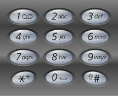

## Algorithm

[17. 电话号码的字母组合](https://leetcode.cn/problems/letter-combinations-of-a-phone-number/description/?envType=study-plan-v2&envId=top-100-liked)

### Description

给定一个仅包含数字 2-9 的字符串，返回所有它能表示的字母组合。答案可以按 任意顺序 返回。

给出数字到字母的映射如下（与电话按键相同）。注意 1 不对应任何字母。




示例 1：

```
输入：digits = "23"
输出：["ad","ae","af","bd","be","bf","cd","ce","cf"]
```

示例 2：

```
输入：digits = ""
输出：[]
```

示例 3：

```
输入：digits = "2"
输出：["a","b","c"]
```

提示：

- 0 <= digits.length <= 4
- digits[i] 是范围 ['2', '9'] 的一个数字。

### Solution

```java
class Solution {
    List<String> list = new LinkedList<>();
    char[][] map = { {}, {}, { 'a', 'b', 'c' }, { 'd', 'e', 'f' }, { 'g', 'h', 'i' }, { 'j', 'k', 'l' },
            { 'm', 'n', 'o' }, { 'p', 'q', 'r', 's' }, { 't', 'u', 'v' }, { 'w', 'x', 'y', 'z' } };

    public List<String> letterCombinations(String digits) {
        if (digits == null || digits.length() == 0) {
            return list;
        }
        backtrack(digits, new StringBuilder(), 0);
        return list;
    }

    private void backtrack(String digits, StringBuilder result, int start) {
        if (start == digits.length()) {
            list.add(new String(result));
            return;
        }
        int num = digits.charAt(start) - '0';
        for (int i = 0; i < map[num].length; i++) {
            result.append(map[num][i]);
            backtrack(digits, result, start + 1);
            result.deleteCharAt(result.length() - 1);
        }
    }
}
```

### Discuss

## Review


## Tip


## Share
