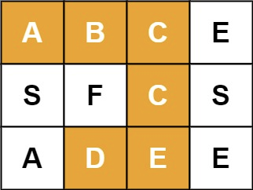
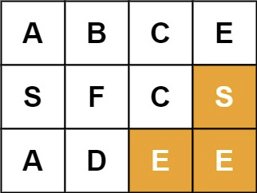
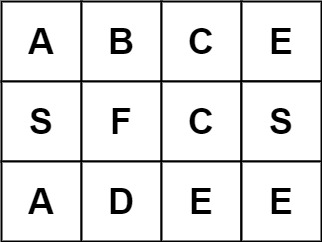

## Algorithm

[79. 单词搜索](https://leetcode.cn/problems/word-search/description/?envType=study-plan-v2&envId=top-100-liked)

### Description

给定一个 m x n 二维字符网格 board 和一个字符串单词 word 。如果 word 存在于网格中，返回 true ；否则，返回 false 。

单词必须按照字母顺序，通过相邻的单元格内的字母构成，其中“相邻”单元格是那些水平相邻或垂直相邻的单元格。同一个单元格内的字母不允许被重复使用。


示例 1：



```
输入：board = [["A","B","C","E"],["S","F","C","S"],["A","D","E","E"]], word = "ABCCED"
输出：true
```

示例 2：



```
输入：board = [["A","B","C","E"],["S","F","C","S"],["A","D","E","E"]], word = "SEE"
输出：true
```

示例 3：



```
输入：board = [["A","B","C","E"],["S","F","C","S"],["A","D","E","E"]], word = "ABCB"
输出：false
```

提示：

- m == board.length
- n = board[i].length
- 1 <= m, n <= 6
- 1 <= word.length <= 15
- board 和 word 仅由大小写英文字母组成


进阶：你可以使用搜索剪枝的技术来优化解决方案，使其在 board 更大的情况下可以更快解决问题？

### Solution

```java
class Solution {
    int[][] dirs = { { 1, 0 }, { -1, 0 }, { 0, 1 }, { 0, -1 } };

    public boolean exist(char[][] board, String word) {
        if (board == null || board.length == 0 || board[0].length == 0)
            return false;
        int m = board.length, n = board[0].length;
        boolean[][] visited = new boolean[m][n];
        for (int i = 0; i < m; i++) {
            for (int j = 0; j < n; j++) {
                if (dfs(board, visited, i, j, 0, word)) {
                    return true;
                }
            }
        }
        return false;
    }

    private boolean dfs(char[][] board, boolean[][] visited, int x, int y, int index, String word) {
        // 终止条件
        if (index == word.length())
            return true; // 所有字符匹配完成
        if (x < 0 || x >= board.length || y < 0 || y >= board[0].length)
            return false; // 越界
        if (visited[x][y] || board[x][y] != word.charAt(index))
            return false; // 已访问或字符不匹配

        // 标记已访问
        visited[x][y] = true;

        // 递归四个方向
        for (int[] dir : dirs) {
            int x1 = x + dir[0], y1 = y + dir[1];
            if (dfs(board, visited, x1, y1, index + 1, word)) {
                return true;
            }
        }

        // 回溯：撤销标记
        visited[x][y] = false;
        return false;
    }
}
```

### Discuss

## Review


## Tip


## Share
