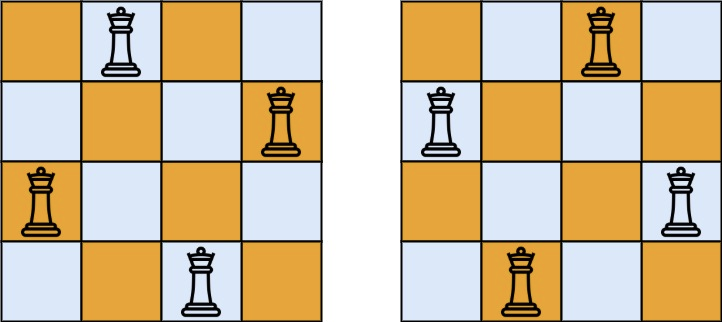

## Algorithm

[51. N 皇后](https://leetcode.cn/problems/n-queens/description/?envType=study-plan-v2&envId=top-100-liked)

### Description

按照国际象棋的规则，皇后可以攻击与之处在同一行或同一列或同一斜线上的棋子。

n 皇后问题 研究的是如何将 n 个皇后放置在 n×n 的棋盘上，并且使皇后彼此之间不能相互攻击。

给你一个整数 n ，返回所有不同的 n 皇后问题 的解决方案。

每一种解法包含一个不同的 n 皇后问题 的棋子放置方案，该方案中 'Q' 和 '.' 分别代表了皇后和空位。

示例 1：



```
输入：n = 4
输出：[[".Q..","...Q","Q...","..Q."],["..Q.","Q...","...Q",".Q.."]]
解释：如上图所示，4 皇后问题存在两个不同的解法。
```

示例 2：

```
输入：n = 1
输出：[["Q"]]
```

提示：

- 1 <= n <= 9

### Solution

```java
class Solution {
    public List<List<String>> solveNQueens(int n) {
        char[][] board = new char[n][n];
        for (int i = 0; i < n; i++)
            Arrays.fill(board[i], '.'); // 初始化棋盘为全空
        List<List<String>> res = new ArrayList<>();
        backtrack(board, 0, res); // 从第0列开始回溯
        return res;
    }

    private void backtrack(char[][] board, int colIndex, List<List<String>> res) {
        if (colIndex == board.length) { // 终止条件：所有列已放置皇后
            res.add(construct(board)); // 记录合法解
            return;
        }
        for (int row = 0; row < board.length; row++) { // 尝试在当前列的每一行放置皇后
            if (validate(board, row, colIndex)) { // 验证当前位置是否合法
                board[row][colIndex] = 'Q'; // 放置皇后
                backtrack(board, colIndex + 1, res); // 递归处理下一列
                board[row][colIndex] = '.'; // 回溯：撤销当前选择
            }
        }
    }

    private boolean validate(char[][] board, int x, int y) {
        for (int i = 0; i < board.length; i++) { // 遍历所有行
            for (int j = 0; j < y; j++) { // 遍历已处理的列（j < y）
                if (board[i][j] == 'Q') {
                    // 检查行冲突（x == i）或对角线冲突
                    // 1. 同一行‌：x == i（已有皇后在第i行）。
                    // 2. 左上对角线‌：x - y == i - j（从左上到右下的斜线）
                    // 3. 右上对角线‌：x + y == i + j（从右上到左下的斜线）
                    if (x == i || x + y == i + j || x - y == i - j) {
                        return false; // 冲突：当前位置不可放置
                    }
                }
            }
        }
        return true; // 无冲突：当前位置合法
    }

    private List<String> construct(char[][] board) {
        List<String> res = new LinkedList<String>();
        for (char[] row : board) {
            res.add(new String(row)); // 将每一行转换为字符串
        }
        return res;
    }
}
```

### Discuss

## Review


## Tip


## Share
