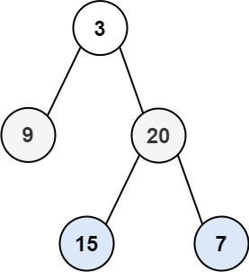

## Algorithm

[102. 二叉树的层序遍历](https://leetcode.cn/problems/binary-tree-level-order-traversal/?envType=study-plan-v2&envId=top-100-liked)

### Description

给你二叉树的根节点 root ，返回其节点值的 层序遍历 。 （即逐层地，从左到右访问所有节点）。

示例 1：



```
输入：root = [3,9,20,null,null,15,7]
输出：[[3],[9,20],[15,7]]
```

示例 2：

```
输入：root = [1]
输出：[[1]]
```

示例 3：

```
输入：root = []
输出：[]
```

提示：

- 树中节点数目在范围 [0, 2000] 内
- -1000 <= Node.val <= 1000

### Solution

```java
class Solution {
    public List<List<Integer>> levelOrder(TreeNode root) {
        if(root == null){
            return new ArrayList<>();
        }
        List<List<Integer>> result = new ArrayList<>();
        Queue<TreeNode> queue = new LinkedList<>();
        queue.offer(root);
        while (!queue.isEmpty()) {
            int size = queue.size();
            List<Integer> res = new ArrayList<>();
            for (int i = 0; i < size; i++) {
                TreeNode node = queue.poll();
                res.add(node.val);
                if (node.left != null) {
                    queue.offer(node.left);
                }
                if (node.right != null) {
                    queue.offer(node.right);
                }
            }
            result.add(res);
        }
        return result;
    }
}
```

### Discuss

## Review


## Tip


## Share
