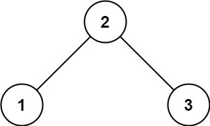
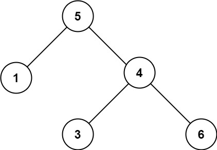

## Algorithm

[98. 验证二叉搜索树](https://leetcode.cn/problems/validate-binary-search-tree/description/?envType=study-plan-v2&envId=top-100-liked)

### Description

给你一个二叉树的根节点 root ，判断其是否是一个有效的二叉搜索树。

有效 二叉搜索树定义如下：

- 节点的左子树只包含 小于 当前节点的数。
- 节点的右子树只包含 大于 当前节点的数。
- 所有左子树和右子树自身必须也是二叉搜索树。


示例 1：



```
输入：root = [2,1,3]
输出：true
```

示例 2：



```
输入：root = [5,1,4,null,null,3,6]
输出：false
解释：根节点的值是 5 ，但是右子节点的值是 4 。
```

提示：

- 树中节点数目范围在[1, 104] 内
- -231 <= Node.val <= 231 - 1

### Solution

```java
class Solution {
    public boolean isValidBST(TreeNode root) {
        return validBST(root, Long.MIN_VALUE, Long.MAX_VALUE);
    }

    public boolean validBST(TreeNode root, long min, long max) {
        if (root == null) {
            return true;
        }
        if (root.val <= min || root.val >= max) {
            return false;
        }
        return validBST(root.left, min, (int) root.val) && validBST(root.right, (int) root.val, max);
    }
}
```

### Discuss

## Review


## Tip


## Share
