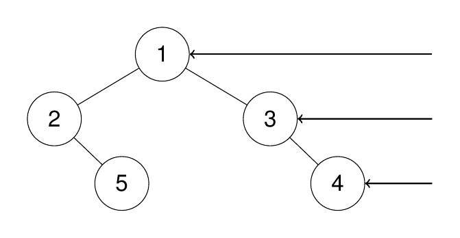
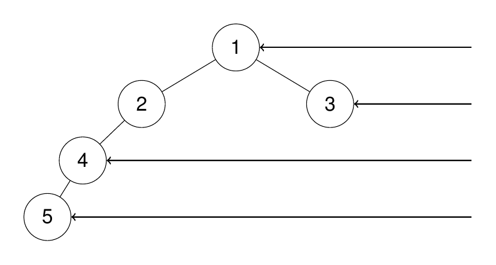

## Algorithm

[199. 二叉树的右视图](https://leetcode.cn/problems/binary-tree-right-side-view/description/?envType=study-plan-v2&envId=top-100-liked)

### Description

给定一个二叉树的 根节点 root，想象自己站在它的右侧，按照从顶部到底部的顺序，返回从右侧所能看到的节点值。


示例 1：

```
输入：root = [1,2,3,null,5,null,4]
输出：[1,3,4]
```

解释：




示例 2：

```
输入：root = [1,2,3,4,null,null,null,5]
输出：[1,3,4,5]
```

解释：



示例 3：

```
输入：root = [1,null,3]
输出：[1,3]
```

示例 4：

```
输入：root = []
输出：[]
```

提示:

- 二叉树的节点个数的范围是 [0,100]
- -100 <= Node.val <= 100

### Solution

```java
class Solution {
    public List<Integer> rightSideView(TreeNode root) {
        List<Integer> result = new ArrayList<>();
        if (root == null) {
            return result;
        }
        Queue<TreeNode> queue = new LinkedList<>();
        queue.offer(root);
        while (!queue.isEmpty()) {
            int size = queue.size();
            for (int i = 0; i < size; i++) {
                TreeNode node = queue.poll();
                if (node.left != null) {
                    queue.offer(node.left);
                }
                if (node.right != null) {
                    queue.offer(node.right);
                }
                if (i == size - 1) {
                    result.add(node.val);
                }
            }
        }
        return result;
    }
}
```

### Discuss

## Review


## Tip


## Share
