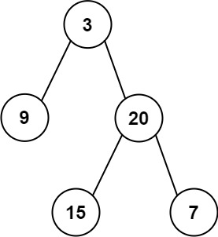

## Algorithm

[105. 从前序与中序遍历序列构造二叉树](https://leetcode.cn/problems/construct-binary-tree-from-preorder-and-inorder-traversal/description/?envType=study-plan-v2&envId=top-100-liked)

### Description

给定两个整数数组 preorder 和 inorder ，其中 preorder 是二叉树的先序遍历， inorder 是同一棵树的中序遍历，请构造二叉树并返回其根节点。

示例 1:



```
输入: preorder = [3,9,20,15,7], inorder = [9,3,15,20,7]
输出: [3,9,20,null,null,15,7]
```

示例 2:

```
输入: preorder = [-1], inorder = [-1]
输出: [-1]
```

提示:

- 1 <= preorder.length <= 3000
- inorder.length == preorder.length
- -3000 <= preorder[i], inorder[i] <= 3000
- preorder 和 inorder 均 无重复 元素
- inorder 均出现在 preorder
- preorder 保证 为二叉树的前序遍历序列
- inorder 保证 为二叉树的中序遍历序列

### Solution

```java
class Solution {
    public TreeNode buildTree(int[] preorder, int[] inorder) {
        if (preorder == null || inorder == null || preorder.length == 0 || inorder.length == 0) {
            return null;
        }
        TreeNode root = new TreeNode(preorder[0]);
        for (int i = 0; i < inorder.length; i++) {
            if (inorder[i] == preorder[0]) {
                root.left = buildTree(Arrays.copyOfRange(preorder, 1, i + 1), Arrays.copyOfRange(inorder, 0, i));
                root.right = buildTree(Arrays.copyOfRange(preorder, i + 1, preorder.length),
                        Arrays.copyOfRange(inorder, i + 1, inorder.length));
            }
        }
        return root;
    }
}
```

### Discuss

## Review


## Tip


## Share
